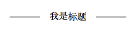

### 标题两边画线效果
<hr>

### 效果图


### 实现
```
.p1:before {
    content: "";
    position: absolute;
    width: 60px;
    height: 1px;
    border-top: 1px solid #000;
    left: 35px;
    top: 15px;
}

.p1:after {
    content: "";
    position: absolute;
    width: 60px;
    height: 1px;
    border-top: 1px solid #000;
    right: 35px;
    top: 15px;
}      
```